# Aboltabolyzer

Bangla hallucination detection for competition submission.

| Field         | Meaning                             |
| ------------- | ----------------------------------- |
| `context`     | Supporting passage, or `[NULL]`     |
| `prompt_bn`   | Bengali question / instruction      |
| `response_bn` | Candidate Bengali answer            |
| **label 0**   | Hallucinated, unsupported, or wrong |
| **label 1**   | Faithful, supported, correct        |

**Architecture:** hybrid task router (static veto + LLM residual) → typed evidence policy (per-corpus RAG; empty idiom/literal falls back to wiki) → fast pass → **asymmetric NLI-first gate** → think fallback → fixed threshold on `p_llm` (`decision.threshold`, default `0.5`). See the pipeline diagram and NLI design note below.

No training. Inference only.

**Machines:** use `hardware_profile = "8gb"` on this debug box (Qwen fast + DeepSeek think). For the real submission run, set `"16gb"` and use Gemma 4 — routing / RAG / NLI policy stay the same; only the verifier model changes.

**Config:** set `hardware_profile` once in [`configs/config.toml`](configs/config.toml). Every `just` recipe (setup, predict, downloads) follows that profile.

**Docs:** [`howto.md`](howto.md) (operator loop) · [`how-it-works.md`](how-it-works.md) (per-row examples) · this README (architecture).

---

## Quick start

Requires [uv](https://github.com/astral-sh/uv), [just](https://github.com/casey/just), and a CUDA GPU.

1. Put competition files in `dataset/`:

```text
dataset/sample_dataset.json    # labeled train (few-shot exemplars on 16GB)
dataset/testset.csv            # full test → submission
dataset/sample_submission.csv  # id,label format example
```

2. Pick a profile in `configs/config.toml`:

```toml
[runtime]
hardware_profile = "16gb"  # RTX 5060 Ti 16GB → Gemma 4
# hardware_profile = "8gb" # RTX 5060 mobile 8GB → ungated Qwen
```

```bash
just show-profile   # confirm resolved verifier / VRAM / RAG batch sizes
```

3. Run on a machine with a real GPU:

```bash
just first-run   # sync → models for this profile + wiki + indexes → preprocess → predict
```

For a 200-row dry run, point `[data].test_path` at `dataset/testset_audit_200.csv` (same columns as the full test file), then `just run`.

4. Upload only:

```text
submissions/latest/submission.csv
```

Inspect:

```text
submissions/latest/submission_debug.csv
```

The 8GB profile is for local debug (ungated Qwen + DeepSeek). The 16GB profile is the submission machine (Gemma 4; may need Hugging Face access).

---

## Pipeline diagram

```mermaid
flowchart TD
    A["Raw test CSV<br/>id · context · prompt_bn · response_bn"] --> B["preprocess.py<br/>NFC · strip ZW chars · empty to NULL<br/>has_context = context not NULL"]

    TRAIN["sample_dataset.json<br/>to processed/train.csv"] -.->|16GB only<br/>exemplar_top_k &gt; 0| EX["indexes/exemplar_index.pkl<br/>few-shot F/H neighbors"]

    B --> RMODE{"[router].routing_mode"}

    RMODE -->|static| RS["route_row only<br/>deterministic cues"]
    RMODE -->|llm| RL["LLM classifies every row"]
    RMODE -->|hybrid default| RH["Hybrid router"]

    subgraph HYB["Hybrid: static veto + LLM residual"]
        direction TB
        RH --> ST["Static route_row<br/>all rows"]
        ST --> VETO{"task in STATIC_VETO?<br/>idiom · literal · grammar<br/>math_* · calendar"}
        VETO -->|yes| KEEP["Keep static task_type<br/>LLM cannot demote"]
        VETO -->|no| LLMR["LLM on residual only<br/>+ sticky-fact / cue guards"]
        KEEP --> TT["task_type assigned"]
        LLMR --> TT
    end

    RS --> TT2["task_type"]
    RL --> TT2
    TT --> EP
    TT2 --> EP

    EP{"Evidence policy<br/>evidence_policy.py"}

    EP -->|"original context present<br/>context_grounded_* / famous_bn_fact_context"| E["Keep original context<br/>rag_used = false<br/>evidence_source = original_context"]

    EP -->|"math_* / calendar / translation<br/>RAG_SKIP_TASKS"| F["No RAG<br/>LLM calculates / bilingual judge<br/>context stays [NULL]"]

    EP -->|"other_null + not factual"| F2["No RAG<br/>rag_skipped_reason =<br/>other_null_not_factual"]

    EP -->|"NULL + RAG allowed"| G{"TASK_RAG_SOURCE<br/>index must exist"}

    G -->|wiki tasks| H1["source = wiki"]
    G -->|idiom_meaning_null| H3["source = idioms"]
    G -->|literal_meaning_null| H4["source = literal"]
    G -->|bangla_grammar| H5["source = grammar"]
    G -->|index missing| K["Skip retrieval<br/>index_missing:source<br/>context stays [NULL]"]

    H1 --> I
    H3 --> I
    H4 --> I
    H5 --> I

    I["BGE-M3 dense retrieve<br/>query = prompt_bn<br/>top_k · similarity_threshold<br/>truncate max_evidence_tokens"]

    I --> HIT{"hits above threshold?"}
    HIT -->|yes| L["Overwrite context<br/>rag_used = true<br/>evidence_source = rag:source"]
    HIT -->|"empty + TASK_RAG_FALLBACK<br/>idiom/literal then wiki"| FB["Retry retrieve on wiki"]
    HIT -->|empty · no fallback| NULLRAG["context stays [NULL]<br/>rag_used = false"]
    FB --> L

    E --> M
    F --> M
    F2 --> M
    K --> M
    L --> M
    NULLRAG --> M
    EX -.->|inject neighbors| M

    M["Task verifier prompt<br/>Task + Rule + evidence + Q/A<br/>TASK_INSTRUCTIONS"]

    M --> N["Fast pass<br/>next-token logits F vs H<br/>p_fast = P Faithful"]

    N --> NLIELIG{"NLI-first eligible?<br/>nli.enabled<br/>task in nli.tasks<br/>non-empty premise<br/>RAG sim ok"}

    NLIELIG -->|no| THINKQ
    NLIELIG -->|yes| NLISCORE["mDeBERTa XNLI<br/>p_entail · p_contradict · p_neutral"]

    NLISCORE --> NLIH{"contradict greater than entail<br/>and margin_hallucinated ok?"}
    NLIH -->|yes| NLI_OUT["nli_applied · p_nli = 0.10<br/>clear think trigger<br/>skip think"]
    NLIH -->|no| NLIF{"entail greater than contradict<br/>and margin_faithful ok?"}

    NLIF -->|no| NLI_FALL["nli_skip_reason =<br/>margin_too_low / ..."]
    NLIF -->|yes| FGUARD{"Faithful guards<br/>all must pass"}

    FGUARD -->|"fail: answer not in premise"| BLO["faithful_low_overlap"]
    FGUARD -->|"fail: entail le neutral"| BLN["entail_le_neutral"]
    FGUARD -->|"fail: p_fast below fast_h_max<br/>block_faithful_on_fast_h"| BLF["faithful_fast_disagrees<br/>escalate to think"]
    FGUARD -->|all pass| NLI_FOUT["nli_applied · p_nli = 0.90<br/>skip think"]

    BLO --> THINKQ
    BLN --> THINKQ
    BLF --> THINKQ
    NLI_FALL --> THINKQ

    THINKQ{"Think? enable_think_pass<br/>OR of triggers"}

    THINKQ -->|near_threshold| Q
    THINKQ -->|famous_bn + near| Q
    THINKQ -->|multi_entity_context + near| Q
    THINKQ -->|math_needs_check + near| Q
    THINKQ -->|grammar wide / sandhi-samas| Q
    THINKQ -->|translation_check + near| Q
    THINKQ -->|evidence_missing_keyphrase + near| Q
    THINKQ -->|no trigger / think off| P["p_llm = p_fast"]

    Q["Think pass CoT<br/>per-task max_think_tokens<br/>verdict-first parse"]

    Q --> R{"Parse verdict?"}
    R -->|Faithful / Hallucinated| S["THINK_SCORE_MAP<br/>0.90 to 0.10 by confidence"]
    R -->|unparsed| T["Keep p_fast<br/>verdict_unparsed"]

    NLI_OUT --> U
    NLI_FOUT --> U
    P --> U
    S --> U
    T --> U

    U["decision.threshold = 0.5<br/>label = 1 if p_llm ge thr else 0"]

    U --> V["submissions/timestamp/submission.csv<br/>id, label only — upload this"]
    U --> W["submission_debug.csv<br/>full trace for analyze"]
    V --> X["submissions/latest symlink"]

    CHK["Checkpoints when use_checkpoints<br/>test_with_evidence.csv<br/>debug_llm_verifier.jsonl<br/>test_llm_preds.csv"] -.->|resume / cache| N
    CHK -.-> U
```



### Task → corpus source

| `task_type`                | Evidence                    | Corpus source    |
| -------------------------- | --------------------------- | ---------------- |
| `context_grounded_*`       | Original context only       | —                |
| `famous_bn_fact_context`   | Original context only       | —                |
| `general_fact_null`        | Typed RAG                   | `wiki`           |
| `other_null` (factual)     | Typed RAG                   | `wiki`           |
| `other_null` (not factual) | No RAG                      | —                |
| `famous_bn_fact_null`      | Typed RAG                   | `wiki`           |
| `idiom_meaning_null`       | Typed RAG; empty → wiki     | `idioms`→`wiki`  |
| `literal_meaning_null`     | Typed RAG; empty → wiki     | `literal`→`wiki` |
| `bangla_grammar`           | Typed RAG when index exists | `grammar`        |
| `math_*` / `calendar_*`    | No RAG — LLM calculates     | —                |
| `math_other`               | No RAG — LLM calculates     | —                |
| `translation_or_bilingual` | No RAG — bilingual judge    | —                |

Empty corpus folders are fine: `just make-rag` skips them, and predict records `index_missing:<source>`. Wiki is filled by `just download-corpus`; idiom / literal / grammar need curated `*.jsonl` (`just make-rag --source <name>` after adding files).

### Hybrid routing (default)

`routing_mode = "hybrid"`: static `route_row` runs first. **Static veto** tasks (`idiom`, `literal`, `bangla_grammar`, all `math_*`, `calendar_arithmetic`) keep the static label even if the LLM disagrees. Remaining rows get an LLM residual label, with guards so sticky facts are not demoted to translation and idiom/literal/grammar/math are not invented without cues.

---

## NLI-first policy

After the fast pass, configured tasks (`[nli].tasks`) with a non-empty premise (original context, or RAG with `retrieval_sim_max ≥ min_rag_sim_for_nli`) may skip think.

| Outcome          | When it auto-applies                                                                                                                                           |
| ---------------- | -------------------------------------------------------------------------------------------------------------------------------------------------------------- |
| **Hallucinated** | `\|entail−contradict\| ≥ margin_hallucinated` (default `0.30`)                                                                                                 |
| **Faithful**     | `\|entail−contradict\| ≥ margin_faithful` (default `0.45`) **and** answer↔premise overlap **and** entail > neutral **and** (if enabled) fast is not strongly H |

Otherwise the row keeps normal think triggers. Debug column `nli_skip_reason` records why a candidate was blocked (`margin_too_low`, `faithful_low_overlap`, `entail_le_neutral`, `faithful_fast_disagrees`, `weak_rag_premise`, …).

### Design note: `block_faithful_on_fast_h`

**Meaning:** if NLI would mark Faithful but `p_fast < fast_h_max_for_nli_faithful` (default `0.40`), do **not** apply NLI / skip think — escalate to the normal think path. It does **not** mean “NLI must agree with fast on every row.” Hallucinated NLI still applies even when fast says Faithful.

**Why keep it on (default for submission / Gemma):** when two systems disagree on Faithful, auto-accepting either is risky. Escalating to think is the generalizable rule across the full test mix and a stronger verifier. Do **not** turn this off just because an 8GB audit dipped — on a weak think model, escalation looks costly; on Gemma 4, disagreement should cost a think pass, not a silent Faithful.

**What not to do:** a hard “NLI only if agrees with fast” gate (hurts overall). Prefer evidence guards (overlap, entail > neutral, asymmetric margins, weak-RAG skip) for false-Faithful control, and this flag only as a **conflict escalator**.

| Knob                          | Default | Role                                 |
| ----------------------------- | ------- | ------------------------------------ |
| `margin_hallucinated`         | `0.30`  | Easier auto-H                        |
| `margin_faithful`             | `0.45`  | Harder auto-F                        |
| `require_faithful_overlap`    | `true`  | Answer tokens must appear in premise |
| `require_entail_gt_neutral`   | `true`  | Topic-overlap FP filter              |
| `block_faithful_on_fast_h`    | `true`  | NLI-F + strong fast-H → think        |
| `fast_h_max_for_nli_faithful` | `0.40`  | Threshold for that escalator         |
| `min_rag_sim_for_nli`         | `0.55`  | Skip NLI on weak RAG premises        |

---

## Installation

```bash
just sync      # install dependencies
just           # list all commands
```

---

## Hardware profiles

Set **`[runtime].hardware_profile`** once. Shared knobs stay in `[gemma]` / `[rag]`; machine-specific model, VRAM, think, and RAG batch sizes live under `[hardware_profiles.<name>.*]`. `resolve_section()` overlays the active profile for every command.

```bash
just show-profile   # print resolved verifier + RAG settings
just first-run      # setup → preprocess → predict for that profile
```

### Profile A — 16GB / Gemma 4 (submission machine)

**Machine:** RTX 5060 Ti 16GB, Kaggle P100/T4, or similar. This is the profile for the real competition run.

```toml
[runtime]
hardware_profile = "16gb"

[hardware_profiles.16gb.gemma]
fast_model_name = "google/gemma-4-E4B-it"
think_model_name = "google/gemma-4-E4B-it"
model_loader = "multimodal_lm"
load_in = "4bit"
device_map = "cuda:0"
cuda_max_memory = "14GiB"
exemplar_top_k = 3
max_input_tokens = 3072
enable_think_pass = true
fast_pass_batch_size = 16

[hardware_profiles.16gb.rag]
batch_size = 128
query_batch_size = 128
```

```bash
just first-run
```

Or step by step:

```bash
just setup             # sync + models for active profile + wiki + make-rag
just preprocess
just predict
```

After assets exist:

```bash
just run               # preprocess → predict
just predict           # prediction only (resumes checkpoints when valid)
just analyze           # evaluate latest prediction run against test ground truth
```

---

### Profile B — 8GB debug (Qwen + DeepSeek think)

**Machine:** RTX 5060 mobile 8GB — local debug / iteration only. Same routing, RAG, and NLI policy as 16GB; weaker verifier, so don’t treat audit scores as final.

```toml
[runtime]
hardware_profile = "8gb"

[hardware_profiles.8gb.gemma]
fast_model_name = "Qwen/Qwen2.5-3B-Instruct"
think_model_name = "deepseek-ai/DeepSeek-R1-Distill-Qwen-7B"
model_loader = "causal_lm"
load_in = "4bit"
device_map = "cuda:0"
cuda_max_memory = "7GiB"
max_input_tokens = 1536
exemplar_top_k = 0
enable_think_pass = true
chat_template_enable_thinking_fast = false
chat_template_enable_thinking_think = true
fast_pass_batch_size = 8

[hardware_profiles.8gb.rag]
batch_size = 32
query_batch_size = 32
```

```bash
just first-run
```

This profile uses `Qwen2.5-3B-Instruct` for the fast pass and `DeepSeek-R1-Distill-Qwen-7B` for the thinking pass. It sequentially unloads the fast model from VRAM to make room before loading the thinking model. The fast F/H pass uses non-thinking chat-template mode so Qwen does not start with `<think>` when the code needs a single F/H token.

---

### OOM / stability

| Symptom          | Fix                                                                                                       |
| ---------------- | --------------------------------------------------------------------------------------------------------- |
| Gemma / Qwen OOM | Use `8gb`, lower `cuda_max_memory` / `max_input_tokens` / `max_think_tokens`, or set `exemplar_top_k = 0` |
| RAG indexing OOM | Lower `batch_size` / `max_seq_length` in `[rag]` or profile RAG overrides                                 |
| Stale RAG scores | `just clean-rag` then `just predict`                                                                      |
| Missing indexes  | `rag_skipped_reason=index_missing:<source>` → fill `corpus/<source>/` then `just make-rag`                |

### Prediction resume

| File                                         | Stage                                   |
| -------------------------------------------- | --------------------------------------- |
| `generated/processed/test_with_evidence.csv` | Routed + typed-RAG-filled test contexts |
| `logs/debug_llm_verifier.jsonl`              | Row-level verifier cache                |
| `generated/processed/test_llm_preds.csv`     | Complete verifier probability vector    |

`[predict].use_checkpoints = true` resumes after OOM. `force_recompute = true` ignores checkpoints for one run.

### Daily workflow

| Goal                   | Command                                           |
| ---------------------- | ------------------------------------------------- |
| Predict only           | `just predict`                                    |
| Force clean prediction | set `force_recompute = true`, then `just predict` |
| Rebuild RAG indexes    | `just make-rag` / `just make-rag --source wiki`   |
| Drop RAG caches        | `just clean-rag`                                  |
| Full refresh           | `just clean-all` → `just setup` → `just run`      |

### Performance tuning

| Knob                                          | Where                         | Effect                                                   |
| --------------------------------------------- | ----------------------------- | -------------------------------------------------------- |
| `routing_mode`                                | `[router]`                    | `static` / `llm` / `hybrid` (static veto + LLM residual) |
| `nli.margin_faithful` / `margin_hallucinated` | `[nli]`                       | Asymmetric skip-think margins                            |
| `nli.require_faithful_overlap`                | `[nli]`                       | Block NLI Faithful without answer↔premise overlap        |
| `nli.require_entail_gt_neutral`               | `[nli]`                       | Block Faithful when entail ≤ neutral                     |
| `nli.block_faithful_on_fast_h`                | `[nli]`                       | NLI Faithful + fast strongly H → think                   |
| `nli.min_rag_sim_for_nli`                     | `[nli]`                       | Skip NLI on weak RAG premises                            |
| `query_batch_size`                            | `[hardware_profiles.*.rag]`   | Faster RAG queries until embed OOM                       |
| `index_dtype`                                 | `[rag]`                       | Compact RAG indexes; default `float16`                   |
| `load_in` / `device_map`                      | `[hardware_profiles.*.gemma]` | Quantization and placement                               |
| `max_input_tokens`                            | `[hardware_profiles.*.gemma]` | Memory vs truncation                                     |
| `enable_think_pass`                           | `[hardware_profiles.*.gemma]` | Explicit think pass toggle                               |
| `think_pass_batch_size`                       | `[hardware_profiles.*.gemma]` | Batched think generate (1 on 8GB)                        |
| `max_think_tokens_by_task`                    | `[gemma]`                     | Per-task CoT token budgets                               |
| `think_conf_low` / `think_conf_high`          | `[gemma]`                     | Near-threshold think band                                |
| `nli.enabled` / `nli.tasks`                   | `[nli]`                       | NLI-first gate task list                                 |
| `exemplar_top_k`                              | `[hardware_profiles.*.gemma]` | Few-shot; `0` skips exemplar embedder                    |
| `decision.threshold`                          | `[decision]`                  | Label cutoff on `p_llm` (default `0.5`)                  |

---

## Verifier Prompt

The prompt is intentionally short and blunt. Fast pass asks for one next token only:

```text
Task: <task_type>
Rule: <task-specific rule>
<evidence>
...
</evidence>
Q: <prompt_bn>
A: <response_bn>
Return one token only: F = faithful/correct/label 1; H = hallucinated/wrong/label 0.
V:
```

The model does not generate a sentence for the fast pass. The code reads next-token logits for F vs H.

Think pass uses verdict-first output so truncation is less likely to lose the parseable answer:

```text
verdict: Faithful|Hallucinated
confidence: strong|likely|uncertain
reason: <one short English sentence>
```

Token budget is per-task via `[gemma.max_think_tokens_by_task]` (math short, grammar longer). Think is skipped when the NLI-first gate applies (`nli_applied`). Remaining think triggers (mostly near-threshold) live in `should_trigger_think` in `evidence_policy.py`: `near_threshold`, `famous_bn_fact`, `multi_entity_context`, `math_needs_check`, grammar wide / `grammar_rule_check`, `translation_check`, `evidence_missing_keyphrase`.

---

## Typed RAG corpora

Four typed sources: `wiki`, `idioms`, `literal`, `grammar`. Empty folders are fine (`index_missing:<source>`).

```bash
just download-corpus                 # → generated/wiki/ (categorized JSONLs and titles)
just download-english-corpus         # → generated/wiki_en/ (English counterparts for places/people)
just sort-corpus data.jsonl          # LLM-sort rows into corpus/<source>/data.jsonl
just sort-corpus data.jsonl -- --dry-run --limit 20
uv run python scripts/sort_corpus.py --tui
just make-rag                        # all non-empty sources
just make-rag --source wiki
```

`sort-corpus` uses the active verifier model from `configs/config.toml`. It writes useful rows under `corpus/wiki`, `corpus/idioms`, `corpus/literal`, or `corpus/grammar`; skipped/noisy rows go under `generated/corpus_sort_skipped/`.

Layout, JSONL examples, writing guidance, and starter filenames: [`corpus/README.md`](corpus/README.md).

---

## Command reference

Run `just` to list recipes.

| Command                        | What it does                                       |
| ------------------------------ | -------------------------------------------------- |
| `just sync`                    | Install deps                                       |
| `just show-profile`            | Print active `hardware_profile` + resolved knobs   |
| `just download-models`         | BGE-M3                                             |
| `just download-models-gemma`   | BGE-M3 + verifier for active profile               |
| `just download-corpus`         | Wiki → `generated/wiki/` (downloads & categorizes) |
| `just download-english-corpus` | Fetch English counterparts to `generated/wiki_en/` |
| `just sort-corpus file.jsonl`  | LLM-sort JSONL rows into typed corpus folders      |
| `just make-rag`                | Build `indexes/<source>.pkl` from corpus folders   |
| `just setup`                   | sync + models + corpus + make-rag                  |
| `just preprocess`              | Clean → `generated/processed/`                     |
| `just predict`                 | Routed inference → `submissions/<timestamp>/`      |
| `just run`                     | preprocess → predict                               |
| `just analyze`                 | Evaluate predictions against test ground truth     |
| `just first-run`               | setup → preprocess → predict (uses profile)        |
| `just first-run-16gb` / `8gb`  | Aliases of `first-run` (set profile in config)     |
| `just clean-rag`               | Drop evidence CSVs + indexes                       |
| `just clean-processed`         | Drop `generated/processed/`                        |
| `just clean-logs`              | Drop verifier JSONL logs                           |
| `just clean-all`               | All cleans                                         |
| `just test` / `lint` / `check` | Dev helpers                                        |

---

## Outputs

### Prediction (`just predict`)

| Path                                           | Contents                                  |
| ---------------------------------------------- | ----------------------------------------- |
| `submissions/<timestamp>/submission.csv`       | `id, label` — **upload this only**        |
| `submissions/<timestamp>/submission_debug.csv` | Full trace for error analysis             |
| `submissions/latest`                           | Symlink → most recent timestamped run dir |
| `generated/processed/test_with_evidence.csv`   | Test after routing + typed RAG            |
| `generated/processed/test_llm_preds.csv`       | Resumable verifier probabilities          |
| `generated/processed/test_with_preds.csv`      | Test with `p_llm` + `task_type`           |
| `logs/debug_llm_verifier.jsonl`                | Per-row verifier debug at inference       |

Partial mid-run debug (if enabled) is written as `submission_partial_debug.csv` about once per minute (`[predict].partial_flush_seconds`, default `60`) and removed when the final submission is complete. Never upload a partial/debug file. Fast/NLI rows are flushed before the long think pass so the run folder is not empty mid-run.

### `submission_debug.csv` columns

Fixed schema for checking mistakes and tuning thresholds:

| Group      | Columns                                                                                                                                                   |
| ---------- | --------------------------------------------------------------------------------------------------------------------------------------------------------- |
| Decision   | `id`, `label`, `p_llm`, `threshold`, `threshold_margin`                                                                                                   |
| Routing    | `task_type`                                                                                                                                               |
| Verifier   | `p_fast`, `p_think`, `triggered_think`, `think_max_tokens`, `think_reasons`, `verdict_parsed`, `confidence_parsed`, `think_changed_label`, `thinking_cot` |
| NLI-first  | `nli_eligible`, `nli_applied`, `nli_skip_reason`, `nli_p_entail`, `nli_p_contradict`, `nli_p_neutral`, `nli_margin`, `p_nli`                              |
| Evidence   | `rag_used`, `rag_source`, `rag_skipped_reason`, `evidence_source`, `evidence_relevance`, `n_retrieved`, `retrieval_sim_max`, `retrieval_sim_mean`         |
| Text       | `context_original`, `context`, `prompt_bn`, `response_bn`                                                                                                 |
| Provenance | `run_timestamp`, `hardware_profile`, `gemma_model_name`, `gemma_load_in`                                                                                  |

Sort by `abs(threshold_margin)` for borderline rows; filter by `task_type` / `rag_source` / `think_changed_label` to find weak categories.

---

## Data files

```text
dataset/sample_dataset.json              # labeled train (exemplars for 16GB few-shot)
dataset/testset.csv                      # competition-like test (2516 rows) → submission
dataset/sample_submission.csv            # id,label format example
dataset/testset_audit_200.csv            # runnable 200-row dry run
dataset/analysis/testset_audit_200.csv   # same 200 rows + gold_label columns to fill
```

### Full test set (`dataset/testset.csv`)

2516 rows · 1155 `[NULL]` context · 1361 with context.

| `task_type`                |                  Count |
| -------------------------- | ---------------------: |
| `context_grounded_fact`    |                    885 |
| `general_fact_null`        |                    575 |
| `context_grounded_other`   |                    342 |
| `other_null`               |                    254 |
| `bangla_grammar`           |                    106 |
| `idiom_meaning_null`       |                     75 |
| `literal_meaning_null`     |                     75 |
| `famous_bn_fact_null`      |                     59 |
| `translation_or_bilingual` |                     59 |
| `math_speed_distance`      |                     23 |
| `famous_bn_fact_context`   |                     17 |
| `calendar_arithmetic`      |                     13 |
| `math_profit_loss`         |                     12 |
| `math_average`             |                     11 |
| `math_work_rate`           |                     10 |
| `math_other`               | (hybrid residual math) |

This is a mixed benchmark: context entailment, null facts, idioms/literal meanings, grammar, arithmetic, famous BN facts, and translation. One blunt “RAG must support the answer” rule fails on idioms/lexicon rows. Task counts shift slightly under hybrid routing — check `submission_debug.csv` / `just analyze`. `math_other` catches residual arithmetic not covered by the specific math buckets.

### 200-row audit set

Stratified slice for labeling and threshold tuning:

| `task_type`                | Count |
| -------------------------- | ----: |
| `context_grounded_fact`    |    40 |
| `general_fact_null`        |    30 |
| `bangla_grammar`           |    18 |
| `context_grounded_other`   |    18 |
| `idiom_meaning_null`       |    15 |
| `literal_meaning_null`     |    15 |
| `famous_bn_fact_null`      |    14 |
| `other_null`               |    12 |
| `translation_or_bilingual` |     8 |
| `math_*` / `calendar_*`    |    25 |
| `famous_bn_fact_context`   |     5 |

Runnable inference file: `dataset/testset_audit_200.csv`  
Label file: `dataset/analysis/testset_audit_200.csv` — fill `gold_label` (`1` faithful / `0` hallucinated), `auditor_confidence`, `needs_human_review`, `audit_reason`.

**Labeling rules:**

1. Judge `response_bn` for `prompt_bn`; use original context when present.
2. Idiom (`ভাবার্থ`) / literal (`শাব্দিক অর্থ`): use language knowledge — do not mark wrong only because RAG is empty.
3. Math/calendar: calculate the answer.
4. Watch common swaps: Mujib ↔ Nazrul ↔ Tagore; Independence Day ↔ Victory Day; Searchlight ↔ Mujibnagar; total vs Bangladesh-only numbers; birth year vs later event year.
5. After labeling, score **by `task_type`**, not only global accuracy.

---

## File-by-file guide

### Root

| File                         | Role                                         |
| ---------------------------- | -------------------------------------------- |
| `README.md`                  | Architecture, hardware, NLI policy, mermaid  |
| `howto.md`                   | Operator cheat sheet (predict / corpus loop) |
| `how-it-works.md`            | Per-row routing / RAG / think examples       |
| `configs/config.toml`        | **All configuration knobs with inline docs** |
| `justfile`                   | Command runner                               |
| `pyproject.toml` / `uv.lock` | Dependencies (uv)                            |
| `requirements.txt`           | Exported deps for non-uv environments        |

### `src/`

| File                 | Role                                                                  |
| -------------------- | --------------------------------------------------------------------- |
| `preprocess.py`      | Bengali text cleanup, `[NULL]` handling, `has_context`                |
| `router.py`          | Hybrid / static / LLM `task_type` routing (static veto + residual)    |
| `evidence_policy.py` | Task→corpus map, wiki fallback, prompts, think triggers, score map    |
| `rag.py`             | Typed corpora, per-source BGE-M3 indexes, scored retrieval            |
| `llm_verifier.py`    | Fast pass → NLI-first gate → think fallback                           |
| `nli.py`             | Asymmetric multilingual NLI gate (confident → skip think)             |
| `predict.py`         | Route → typed evidence → verifier → threshold → submission + debug    |
| `tui.py`             | Shared Rich banners / progress / tables                               |
| `config_utils.py`    | Hardware profile resolution, model path cache, runtime torch settings |

### `scripts/`

| File                         | Role                                                     |
| ---------------------------- | -------------------------------------------------------- |
| `download_models.py`         | Hugging Face snapshots → `models/hf/`                    |
| `download_corpus.py`         | Bengali Wikipedia → `generated/wiki/` (+ categorize)     |
| `download_english_corpus.py` | English wiki counterparts → `generated/wiki_en/`         |
| `sort_corpus.py`             | LLM-sort JSONL into typed `corpus/<source>/`             |
| `analyze_submission.py`      | Accuracy / task / think / RAG breakdown (`just analyze`) |

### Generated (gitignored)

| Path                   | Role                                            |
| ---------------------- | ----------------------------------------------- |
| `generated/processed/` | Intermediate CSVs                               |
| `corpus/<source>/`     | Typed RAG documents (`*.jsonl`)                 |
| `indexes/<source>.pkl` | Per-source dense indexes (+ optional exemplars) |
| `models/`              | HF cache / offload                              |
| `submissions/`         | Final + debug CSVs                              |
| `logs/`                | Verifier JSONL debug logs                       |

---

## Known weaknesses

1. **Typed lexical corpora start thin** — idiom / literal / grammar need curated `*.jsonl` (`just make-rag --source <name>`). Grammar has a small seed only.
2. **Math/calendar rows are LLM-only** — no symbolic solver; RAG skipped; weak on 8GB, better on Gemma.
3. **8GB debug verifier ≠ submission** — `Qwen2.5-3B` fast + `DeepSeek-R1-Distill-Qwen-7B` think. Same routing/RAG/NLI policy as 16GB; do not treat audit accuracy as final.
4. **`block_faithful_on_fast_h` can look costly on 8GB** — weak think makes escalation hurt audit scores; keep it for Gemma / general conflict handling (see NLI design note).
5. **Evidence cache stickiness** — after corpus/index/RAG config changes, `just clean-rag` before `just predict`. After NLI/router policy changes, set `force_recompute = true` once (or clear verifier jsonl / preds).
6. **Kaggle packaging not automated**.

---

## Roadmap

- [ ] Fill idiom / literal / grammar corpus tables and rebuild indexes
- [ ] Run full `testset.csv` on 16GB Gemma 4 for submission
- [ ] Raise per-task `max_think_tokens` on 16GB if `verdict_unparsed` rises
- [ ] Kaggle Dataset bundle + offline submit notebook
