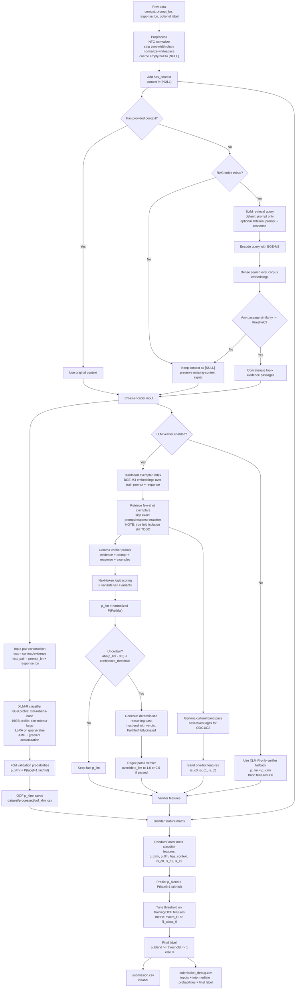

# Aboltabolyzer

A competition pipeline for Bangla hallucination detection.

Given:

- `context`: supporting passage, or `[NULL]`
- `prompt_bn`: Bengali prompt/question/instruction
- `response_bn`: candidate Bengali response

Predict:

- `label = 0`: hallucinated, unsupported, fabricated, or factually wrong
- `label = 1`: faithful, supported, and factually correct

The goal is to perform well on the hallucinated class while keeping macro F1 strong. This repo is a serious prototype, not a finished detector. The current best strategy is to build a reproducible XLM-R baseline first, then carefully add RAG and LLM verifier features only when out-of-fold validation proves they help.

---

## What This System Does

The pipeline supports:

1. Unicode and whitespace cleanup for Bengali text.
2. Context detection for `[NULL]` rows.
3. Optional dense retrieval for missing context rows.
4. XLM-R sequence classification with LoRA.
5. Optional Gemma verifier scoring.
6. Optional C0/C1/C2 cultural-distance feature extraction.
7. Meta-classifier blending.
8. Tuned thresholding for final labels.
9. Debug CSV output for error analysis.

Important honesty note: XLM-R fold predictions are out-of-fold. The LLM verifier features still need true out-of-fold generation before hybrid validation scores should be trusted.

---

## Detailed Pipeline Diagram



---

## Hardware Strategy

The repo is set up for two available machines.

### Local RTX 5060 8GB

Use this machine for fast iteration, preprocessing, smoke runs, and XLM-R-only debugging.

Recommended config:

```toml
[runtime]
hardware_profile = "8gb"
use_llm_verifier = false
fail_on_model_error = true
```

The `8gb` profile:

```toml
[hardware_profiles.8gb.xlmr]
model_name = "FacebookAI/xlm-roberta-base"
max_length = 384
batch_size = 2
grad_accum_steps = 8
use_amp = true

[hardware_profiles.8gb.gemma]
max_think_tokens = 128
```

### Desktop RTX 5060 16GB

Use this machine for larger folds, RAG experiments, LLM verifier runs, and final inference.

Recommended config:

```toml
[runtime]
hardware_profile = "16gb"
use_llm_verifier = true
fail_on_model_error = true
```

The `16gb` profile:

```toml
[hardware_profiles.16gb.xlmr]
model_name = "FacebookAI/xlm-roberta-large"
max_length = 512
batch_size = 4
grad_accum_steps = 4
use_amp = true

[hardware_profiles.16gb.gemma]
max_think_tokens = 256
```

If 16GB is stable, increase `batch_size`. If it OOMs, reduce `max_length` first.

---

## Safety Rules

The pipeline should never silently create fake submissions.

Current behavior:

- Random fallback predictions have been removed.
- `fail_on_model_error = true` stops training or prediction if the LLM verifier fails.
- `fail_on_model_error = false` deliberately falls back to XLM-R-only scores.
- `use_llm_verifier = false` disables the LLM path for lightweight local experiments.

For serious runs, keep:

```toml
fail_on_model_error = true
```

---

## Installation

Install `uv` and `just`, then run:

```bash
just sync
```

Show available commands:

```bash
just
```

---

## Downloading Assets

Download setup is handled through `justfile` recipes.

### Models

Download the active-profile XLM-R model plus the RAG embedding model:

```bash
just download-models
```

Download XLM-R models for both 8GB and 16GB profiles plus the RAG embedding model:

```bash
just download-models-all
```

Download Gemma too:

```bash
just download-models-gemma
```

Gemma may require Hugging Face gated-model access.

### Corpus

Download and chunk Bengali Wikipedia:

```bash
just download-corpus
```

Small corpus download for quick RAG smoke testing:

```bash
just download-corpus-small
```

Build the dense RAG index:

```bash
just build-index
```

Download corpus and build the index:

```bash
just prepare-rag
```

Download all non-gated assets and build the RAG index:

```bash
just prepare-assets
```

---

## Data Files

Expected competition files:

```text
dataset/sample_dataset.json
dataset/.3_testset.csv
dataset/sample_submission.csv
```

Configured paths:

```toml
[data]
sample_path = "dataset/sample_dataset.json"
test_path = "dataset/.3_testset.csv"
processed_dir = "dataset/processed"
submission_output_path = "submissions/submission.csv"
```

---

## RAG Details

RAG is used only for rows where context is `[NULL]`.

Default query mode:

```toml
[rag]
query_mode = "prompt"
```

This is safer for hallucination detection. If the candidate response is false, using the response in the retrieval query can fetch evidence about the false claim and make the model overtrust it.

Experimental ablation:

```toml
query_mode = "prompt_response"
```

Use that only for comparison against prompt-only retrieval.

Corpus files should live under:

```text
corpus/
```

Each `.jsonl` line should contain either:

```json
{ "text": "..." }
```

or:

```json
{ "passage": "..." }
```

---

## Running the Pipeline

### Preprocess

```bash
just preprocess
```

Writes:

```text
dataset/processed/train.csv
dataset/processed/test.csv
```

### Train

```bash
just train
```

Main outputs:

```text
dataset/processed/train_with_evidence.csv
dataset/processed/oof_xlmr.csv
dataset/processed/train_with_preds.csv
models/xlmr/best_fold_*.pt
models/blender_config.pkl
```

### Predict

```bash
just predict
```

Main outputs:

```text
dataset/processed/test_with_evidence.csv
dataset/processed/preds_test_xlmr.csv
dataset/processed/test_with_preds.csv
submissions/submission.csv
submissions/submission_debug.csv
```

### Test

```bash
just test
```

The dense-RAG test can load or download a SentenceTransformer model. Avoid running tests on machines where downloads or model loading are not desired.

---

## Important Config Knobs

```toml
[runtime]
hardware_profile = "8gb"      # "8gb" or "16gb"
use_llm_verifier = false      # false for local baseline work
fail_on_model_error = true    # true for serious runs

[rag]
query_mode = "prompt"
similarity_threshold = 0.5
top_k = 5

[blender]
threshold_metric = "macro_f1"
```

Also test:

```toml
threshold_metric = "f1_class_0"
```

because `label = 0` is the hallucinated class.

---

## Recommended Workflow

### 1. Local 8GB Baseline

Set:

```toml
hardware_profile = "8gb"
use_llm_verifier = false
```

Run:

```bash
just sync
just preprocess
just train
just predict
```

Use this to debug the classifier, thresholding, and submission formatting.

### 2. Local RAG Smoke Test

Run:

```bash
just download-corpus-small
just build-index
```

Then train/predict again and compare against no-RAG or prompt-only settings.

### 3. 16GB Full Experiment

Set:

```toml
hardware_profile = "16gb"
use_llm_verifier = true
fail_on_model_error = true
```

Run:

```bash
just prepare-assets
just train
just predict
```

If using Gemma:

```bash
just download-models-gemma
```

Then run training/prediction with `use_llm_verifier = true`.

---

## File-by-File Guide

### Root Files

- `README.md`: Main documentation, usage guide, system design, hardware strategy, and current limitations.
- `plan.md`: Short roadmap pointer. The full plan is now merged into this README.
- `pyproject.toml`: Python project metadata, dependencies, Ruff config, and Pyright path config.
- `uv.lock`: Locked dependency graph for reproducible `uv` installs.
- `requirements.txt`: Exported dependency list for non-`uv` environments.
- `justfile`: Command runner for setup, downloads, preprocessing, training, prediction, testing, linting, and formatting.
- `LICENSE`: Project license.
- `main.py`: Placeholder entry point; the real pipeline entry points are under `src/`.

### Config

- `configs/config.toml`: Central runtime config. Controls data paths, RAG settings, XLM-R training settings, Gemma settings, blender threshold metric, and 8GB/16GB hardware profiles.

### Source Code

- `src/config_utils.py`: Small helpers for resolving active hardware-profile overrides and checking error policy.
- `src/preprocess.py`: Reads raw JSON/CSV, cleans Bengali text, normalizes Unicode, strips zero-width characters, detects `[NULL]`, adds `has_context`, and writes processed CSVs.
- `src/rag.py`: Dense RAG indexer and retriever. Loads `.jsonl` corpora, embeds passages with SentenceTransformer/BGE-M3, saves `indexes/dense_index.pkl`, and retrieves top evidence passages.
- `src/xlmr_encoder.py`: XLM-R sequence classification code. Builds `(context, prompt + response)` inputs, trains LoRA classifiers with stratified folds, supports AMP and gradient accumulation, saves fold weights, and predicts test probabilities.
- `src/llm_verifier.py`: Optional Gemma verifier. Builds/retrieves dynamic few-shot exemplars, classifies cultural band C0/C1/C2, extracts F/H next-token probabilities, optionally runs a deterministic reasoning pass, and logs verifier debug data.
- `src/blender.py`: Meta-classifier for combining `p_xlmr`, `p_llm`, `has_context`, and C0/C1/C2 features. Fits RandomForest, tunes a final probability threshold, saves/loads blender state.
- `src/train.py`: End-to-end training orchestration. Runs preprocessing if needed, applies optional RAG, trains XLM-R folds, optionally runs verifier features, fits blender, and prints metrics.
- `src/predict.py`: End-to-end test inference. Applies optional RAG, loads XLM-R fold models, optionally runs verifier features, loads blender, writes final submission and debug submission.
- `src/evaluate.py`: Metric reporting for macro F1, hallucinated-class F1, faithful-class F1, confusion matrix, and classification report.

### Scripts

- `scripts/download_models.py`: Downloads configured Hugging Face models into `models/hf/`. Used by `just download-models`, `just download-models-all`, and `just download-models-gemma`.
- `scripts/download_corpus.py`: Downloads and chunks Bengali Wikipedia into `corpus/wiki_bn.jsonl`. Used by `just download-corpus` and `just download-corpus-small`.

### Tests

- `tests/test_pipeline.py`: Unit tests for text cleaning, Bengali tokenization, blender behavior, and dense RAG. The dense RAG test may download/load a model.

### Data and Generated Directories

- `dataset/sample_dataset.json`: Labeled sample/training examples.
- `dataset/sample_submission.csv`: Example submission format.
- `dataset/.3_testset.csv`: Expected test set path if present locally.
- `dataset/processed/`: Generated preprocessed data and intermediate predictions.
- `corpus/`: Local RAG corpora in `.jsonl` format.
- `indexes/`: Generated dense retrieval and exemplar indexes.
- `models/`: Generated fold weights, blender pickle, and optional downloaded HF snapshots.
- `submissions/`: Generated final and debug submissions.
- `logs/`: Generated verifier debug logs.

---

## Known Weaknesses

These are still real issues:

1. LLM verifier features are not truly out-of-fold yet.
2. C0/C1/C2 band predictions are produced by the LLM and are not independently verified.
3. RAG quality is not logged deeply enough; retrieval scores should be exposed.
4. RandomForest blending can overfit small OOF feature sets.
5. Threshold tuning should be based only on leakage-safe OOF predictions.
6. Bengali-native encoders still need proper benchmarking.

---

## Roadmap

- [x] Add 8GB and 16GB hardware profiles.
- [x] Add AMP and gradient accumulation knobs.
- [x] Remove random verifier fallbacks.
- [x] Make RAG query mode configurable.
- [x] Tune and save blender threshold.
- [x] Move model/corpus download setup into `justfile`.
- [ ] Generate true OOF LLM verifier features.
- [ ] Add retrieval similarity scores to debug outputs.
- [ ] Compare `macro_f1` vs `f1_class_0` thresholding.
- [ ] Benchmark XLM-R base, XLM-R large, BanglaBERT-style encoders, and multilingual DeBERTa-style encoders.
- [ ] Replace or validate RandomForest blender against simpler calibrated linear models.
