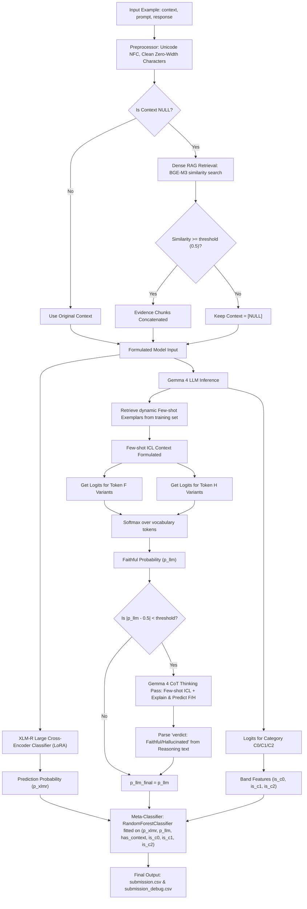

# Aboltabolyzer

A high-performance pipeline for detecting hallucinations in Bengali LLM responses. The project utilizes a hybrid approach combining a fine-tuned cross-encoder (XLM-RoBERTa) with a token-efficient LLM verifier (Gemma 4 E4B), optimized with a confidence-gated fallback mechanism and a context-conditional score blender.

Designed to be executed within a virtual environment managed by `uv` and runnable via `just`.

---

## Pipeline Architecture

The flowchart below describes the end-to-end processing, classification, and blending paths inside the pipeline:



---

## Installation & Setup

Ensure you have [uv](https://github.com/astral-sh/uv) and [just](https://github.com/casey/just) installed on your system.

```bash
# 1. Clone the repository and navigate inside
git clone https://github.com/hamedzurat/aboltabolyzer
cd aboltabolyzer

# 2. Sync dependencies and build the virtual environment (managed by uv)
just sync
```

---

## Download Corpus & Model Weights (Target Machine)

Before executing training or inference on the target machine, you must acquire the relevant corpus files and model weights:

### 1. RAG Corpus Datasets

RAG is triggered for NULL-context rows to fetch evidence context. Save these in the `corpus/` directory:

- **Bengali Wikipedia**:
  - _Direct Download_: [bnwiki-latest-pages-articles.xml.bz2](https://dumps.wikimedia.org/bnwiki/latest/bnwiki-latest-pages-articles.xml.bz2) (~500 MB compressed / 2.5 GB raw).
  - _HF Alt_: Load using `datasets` library via `load_dataset("wikimedia/wikipedia", "20231101.bn")`.
  - Chunk into ~300-token passages with 50-token overlap, and save as `corpus/wiki_bn.jsonl`.
- **BnQA / BanglaQA Passages**:
  - Download the passage-only split of `csebuetnlp/bnqa` (or alternatives `rezaul/bnqa` / `sajib/bengali-qa`) and save as `corpus/bnqa.jsonl`.
- **BanglaFact (Optional)**:
  - Search `Hasan28/bn_facts` on Hugging Face. Convert fact triplets to sentences and save as `corpus/facts_bn.jsonl`.
- **CC-100 Bengali (Optional)**:
  - Download from Hugging Face (`cc100`, config `bn`). Since it is large (~30 GB), filter to the first 1M sentences with at least 10 tokens and save as `corpus/cc100_bn.jsonl`.

### 2. Model Weights

- **Gemma 4 (google/gemma-4-E4B-it)**:
  - Requires a Hugging Face Access Token with permissions approved at [huggingface.co/google/gemma-4-E4B-it](https://huggingface.co/google/gemma-4-E4B-it).
  - Download command:
    ```bash
    huggingface-cli download google/gemma-4-E4B-it --local-dir models/gemma-4-E4B-it
    ```
- **XLM-RoBERTa Large (FacebookAI/xlm-roberta-large)**:
  - Auto-downloaded by the transformers library at runtime.

---

## Usage (Recipes)

The repository provides a `justfile` containing recipes for running each stage. All recipes automatically execute inside the `uv` virtual environment.

To see all available commands:

```bash
just
```

### 1. Preprocessing

Cleans Bengali text, normalizes Unicode to NFC, strips zero-width spaces/joiners, handles data type coercion, and caches output to `dataset/processed/`.

```bash
just preprocess
```

### 2. Build Dense RAG Index

Reads all `.jsonl` files in `corpus/`, encodes them into dense semantic vectors using the BGE-M3 embedding model, and serializes the index to `indexes/dense_index.pkl` to retrieve evidence for NULL-context queries.

```bash
just build-index
```

### 3. Train & Tune Pipeline

Processes the training fold data. For each fold:

1. Ground NULL-context rows using RAG evidence.
2. Fine-tune `FacebookAI/xlm-roberta-large` using LoRA sequence classification adapter with a cosine LR schedule and early stopping.
3. Compute out-of-fold (OOF) predictions.
4. Run `google/gemma-4-E4B-it` verifier with dynamic few-shot exemplars and cultural-band classification via logit extraction.
5. Fit a `RandomForestClassifier` meta-classifier on the 6-feature vector `[p_xlmr, p_llm, has_context, is_c0, is_c1, is_c2]`.

```bash
just train
```

### 4. Inference & Submission

Performs ensembled inference on the test dataset (`dataset/.3_testset.csv`), applying RAG grounding, ensembled XLM-R cross-encoder predictions, Gemma 4 few-shot verifications with cultural-band classification, and a trained RandomForest meta-classifier to blend all signals into `submissions/submission.csv` and `submissions/submission_debug.csv`.

```bash
just predict
```

### 5. Unit Tests

Runs the test suite verifying text normalization, tokenization, and blender optimizations.

```bash
just test
```

### 6. Code Style (Ruff)

Lints and formats the codebase automatically.

```bash
just lint
just format
```

---

## Directory Structure

```
aboltabolyzer/
├── pyproject.toml            # uv-managed dependencies & ruff configuration
├── justfile                  # just task runner configuration
├── configs/
│   └── config.toml           # Central TOML configuration parameters
├── src/
│   ├── preprocess.py         # Bengali text cleaning & normalization
│   ├── rag.py                # Dense RAG index builder & retriever (BGE-M3)
│   ├── xlmr_encoder.py       # XLM-RoBERTa Sequence Classification (LoRA)
│   ├── llm_verifier.py       # Gemma 4 4-bit prompt + logit extraction
│   ├── blender.py            # Score blending & threshold optimization
│   ├── train.py              # Fold CV loop & blend search
│   ├── predict.py            # Ensembled inference generator
│   └── evaluate.py           # Metric calculation utilities
├── tests/
│   └── test_pipeline.py      # Unit tests
└── dataset/
    ├── sample_dataset.json   # Annotations for train / validation
    ├── .3_testset.csv        # Kaggle test set
    └── sample_submission.csv # Expected submission structure
```

---

## Key Highlights

1. **Token-Efficient Prompts**: Zero-shot prompt extracts next-token logits over `F`/`H` (Faithful/Hallucinated) variants, saving generation time. Uncertain predictions trigger a Chain-of-Thought pass that asks for a full `verdict: Faithful` or `verdict: Hallucinated` verdict, parsed with a regex.
2. **Confidence Gate**: When `|p_llm - 0.5| < threshold`, a CoT thinking pass generates a reasoned explanation ending in a full-word verdict, overriding the fast-path probability.
3. **Grouped Cross-Validation**: 5-fold stratified CV with cosine LR schedule (10% warmup) and gradient clipping trains the XLM-R cross-encoder. Best fold weights are saved to `models/xlmr/`.
4. **6-Feature RandomForest Meta-Classifier**: A `RandomForestClassifier` is fitted on OOF predictions using features `[p_xlmr, p_llm, has_context, is_c0, is_c1, is_c2]`, learning context-aware and cultural-band-sensitive ensembling rules without needing a manual grid search.
5. **Rich Terminal Visuals**: Every phase runs with styled progress bars, panels, and loading spinners.
