# Aboltabolyzer

Bangla hallucination detection for competition submission.

| Field         | Meaning                             |
| ------------- | ----------------------------------- |
| `context`     | Supporting passage, or `[NULL]`     |
| `prompt_bn`   | Bengali question / instruction      |
| `response_bn` | Candidate Bengali answer            |
| **label 0**   | Hallucinated, unsupported, or wrong |
| **label 1**   | Faithful, supported, correct        |

**Architecture:** XLM-R (LoRA) produces an encoder prior → Gemma gives the final verdict → one OOF-tuned threshold on `p_llm` decides the label. No RandomForest blender.

**Config:** all knobs are documented in [`configs/config.toml`](configs/config.toml).

---

## Pipeline diagram

```mermaid
flowchart TD
    A["Raw data<br/>context, prompt_bn, response_bn, optional label"] --> B["Preprocess<br/>NFC normalize · strip zero-width chars<br/>whitespace cleanup · empty → [NULL]"]
    B --> C["has_context = context != [NULL]"]

    C --> D{"Provided context?"}
    D -->|"Yes"| E["Keep original context"]
    D -->|"No"| F{"RAG index exists?"}

    F -->|"No"| G["context stays [NULL]"]
    F -->|"Yes"| H["Query = prompt_bn only<br/>(see query_mode in config)"]

    H --> I["Embed query · BGE-M3"]
    I --> J["Dense cosine search · top_k passages"]
    J --> K{"score >= similarity_threshold?"}
    K -->|"Yes"| L["Join passages · truncate max_evidence_tokens<br/>log n_retrieved · sim_max · sim_mean"]
    K -->|"No"| G

    E --> M["Cross-encoder input"]
    G --> M
    L --> M

    M --> N["text = context/evidence<br/>text_pair = prompt_bn + response_bn"]
    N --> O["XLM-R + LoRA · 5-fold CV<br/>8gb: roberta-base · 16gb: roberta-large"]

    O --> P["p_xlmr = P(faithful)"]
    P --> Q["OOF → dataset/processed/oof_xlmr.csv"]

    M --> R{"use_llm_verifier?"}
    R -->|"No"| S["p_llm = p_xlmr"]
    R -->|"Yes"| T["Fold-isolated exemplar index<br/>few-shot from train fold only"]

    T --> U["Retrieve 3 similar train exemplars"]
    U --> V["Cultural band C0/C1/C2<br/>routes think-pass only"]

    Q --> X["Gemma prompt<br/>encoder prior + evidence + Q/A + exemplars"]
    U --> X
    V --> X
    X --> Y["Fast pass · F/H next-token logits<br/>p_fast = P(Faithful)"]

    Y --> AA{"Think trigger?<br/>uncertain · encoder disagree<br/>C0+NULL · C2"}
    AA -->|"No"| AB["p_llm = p_fast"]
    AA -->|"Yes"| AC["CoT think pass<br/>verdict: Faithful / Hallucinated"]
    AC --> AD["Parse verdict → p_llm ∈ {0.0, 1.0}"]

    AB --> AE["OOF p_llm · train only"]
    AD --> AE
    S --> AE

    AE --> AI["Grid-search threshold on OOF p_llm<br/>macro_f1 or f1_class_0"]
    AI --> AJ["label = 1 if p_llm >= threshold else 0"]

    AJ --> AK["submissions/submission.csv"]
    AJ --> AL["submissions/submission_debug.csv<br/>RAG scores · p_xlmr · p_llm · think meta · label"]
```



---

## Installation

Requires [uv](https://github.com/astral-sh/uv) and [just](https://github.com/casey/just).

```bash
just sync      # install dependencies
just           # list all commands
```

---

## Hardware profiles

Pick one profile, edit **`configs/config.toml` `[runtime]`**, then run the command block below.

### Profile A — 16GB full pipeline (recommended for submission)

**Machine:** RTX 5060 16GB, Kaggle P100/T4, or similar.

**Set in `configs/config.toml`:**

```toml
[runtime]
hardware_profile = "16gb"
use_llm_verifier = true
fail_on_model_error = true

[hardware_profiles.16gb.rag]
batch_size = 64
max_seq_length = 512
```

**Commands (first time):**

```bash
just first-run-16gb
```

Or step by step:

```bash
just sync
just prepare-full             # models (incl. Gemma) + wiki + RAG index
just preprocess
just train
just predict
```

**Commands (after assets exist):**

```bash
just submit                   # train + predict
# or, if raw data changed:
just run                      # preprocess + train + predict
```

**Notes:** Training runs Gemma ~5× on the 299 train rows (one OOF fold pass each). Inference is one Gemma pass per test row (+ think on a subset).

---

### Profile B — 8GB XLM-R debug (no Gemma)

**Machine:** RTX 5060 8GB or any GPU too small for Gemma + XLM-R together.

**Set in `configs/config.toml`:**

```toml
[runtime]
hardware_profile = "8gb"
use_llm_verifier = false
fail_on_model_error = true

[hardware_profiles.8gb.rag]
batch_size = 32
max_seq_length = 512
```

**Commands:**

```bash
just first-run-8gb
```

Or step by step: `just sync` → `just prepare-lite` → `just preprocess` → `just train` → `just predict`

Use this to debug preprocessing, RAG, and cross-encoder training without loading Gemma.

---

### Profile C — RAG smoke test

Add to either profile after first setup:

```bash
just smoke-rag
```

Or: `just download-corpus-small` → `just build-index` → `just submit`

Compare `submission_debug.csv` columns `n_retrieved`, `retrieval_sim_max`, `rag_filled` with and without the index.

---

### OOM / stability

| Symptom          | Fix                                                                                   |
| ---------------- | ------------------------------------------------------------------------------------- |
| XLM-R OOM        | Lower `batch_size` or `max_length` in active hardware profile (`configs/config.toml`) |
| Gemma OOM        | Reduce `max_think_tokens` in config                                                   |
| RAG Indexing OOM | Lower `batch_size` or `max_seq_length` in `[rag]` or profile-specific `[hardware_profiles.<profile>.rag]` section |
| Stale RAG scores | `just clean-rag-cache` then re-run `just train` / `just predict`                      |

---

## Command reference

Run `just` to see recipes grouped by **setup**, **workflows**, **pipeline**, **cache**, **dev**.

### Workflows (start here)

| Command               | What it does                                                  |
| --------------------- | ------------------------------------------------------------- |
| `just first-run-16gb` | sync → prepare-full → preprocess → train → predict            |
| `just first-run-8gb`  | sync → prepare-lite → preprocess → train → predict (no Gemma) |
| `just run`            | preprocess → train → predict                                  |
| `just submit`         | train → predict (data already preprocessed)                   |
| `just smoke-rag`      | small wiki → index → train → predict                          |

### Setup

| Command                      | What it does                                            |
| ---------------------------- | ------------------------------------------------------- |
| `just sync`                  | Install Python deps via uv                              |
| `just prepare-full`          | Gemma + both XLM-R profiles + BGE-M3 + wiki + RAG index |
| `just prepare-assets`        | Both XLM-R profiles + BGE-M3 + wiki + index (no Gemma)  |
| `just prepare-lite`          | Active-profile XLM-R + BGE-M3 only                      |
| `just prepare-rag`           | Full wiki download + build index                        |
| `just download-models`       | XLM-R for active profile + BGE-M3                       |
| `just download-models-all`   | XLM-R for both profiles + BGE-M3                        |
| `just download-models-gemma` | Above + Gemma                                           |
| `just download-corpus`       | Full Bengali Wikipedia → `corpus/`                      |
| `just download-corpus-small` | 200-article wiki sample                                 |
| `just build-index`           | Build `indexes/dense_index.pkl`                         |

### Pipeline

| Command           | What it does                                           |
| ----------------- | ------------------------------------------------------ |
| `just preprocess` | Clean data → `dataset/processed/train.csv`, `test.csv` |
| `just train`      | Full training pipeline                                 |
| `just predict`    | Test inference → `submissions/`                        |

### Cache

| Command                | What it does                           |
| ---------------------- | -------------------------------------- |
| `just clean-rag-cache` | Drop cached `*_with_evidence.csv` only |
| `just clean-processed` | Remove all of `dataset/processed/`     |
| `just clean-logs`      | Remove Gemma JSONL debug logs          |
| `just clean-all`       | All of the above                       |

### Dev

| Command                     | What it does             |
| --------------------------- | ------------------------ |
| `just test`                 | pytest                   |
| `just lint` / `just format` | Ruff                     |
| `just check`                | lint + test              |
| `just export`               | Write `requirements.txt` |

---

## Outputs

### Training (`just train`)

| Path                                        | Contents                                         |
| ------------------------------------------- | ------------------------------------------------ |
| `dataset/processed/train_with_evidence.csv` | Train rows after RAG (+ retrieval score columns) |
| `dataset/processed/oof_xlmr.csv`            | OOF XLM-R probabilities                          |
| `dataset/processed/train_with_preds.csv`    | OOF `p_xlmr` + OOF `p_llm`                       |
| `models/xlmr/best_fold_*.pt`                | LoRA checkpoints (5 folds)                       |
| `models/blender_config.pkl`                 | Tuned threshold (legacy filename)                |
| `indexes/exemplar_index.pkl`                | Full train exemplars for inference               |
| `logs/debug_llm_verifier_oof_fold_*.jsonl`  | Per-fold Gemma debug during training             |

### Prediction (`just predict`)

| Path                                       | Contents                         |
| ------------------------------------------ | -------------------------------- |
| `submissions/submission.csv`               | `id, label` — upload this        |
| `submissions/submission_debug.csv`         | Full trace for error analysis    |
| `dataset/processed/test_with_evidence.csv` | Test after RAG                   |
| `dataset/processed/test_with_preds.csv`    | Test with `p_xlmr`, `p_llm`      |
| `logs/debug_llm_verifier.jsonl`            | Per-row Gemma debug at inference |

### `submission_debug.csv` columns

`id`, `has_context`, `context_original`, `context`, `prompt_bn`, `response_bn`, `n_retrieved`, `retrieval_sim_max`, `retrieval_sim_mean`, `rag_filled`, `p_xlmr`, `p_llm_no_think`, `p_llm`, `p_final`, `threshold`, `threshold_metric`, `encoder_disagree`, `triggered_think`, `think_reasons`, `is_c0`, `is_c1`, `is_c2`, `used_llm_verifier`, `label`

---

## Data files

Place competition files here:

```text
dataset/sample_dataset.json    # labeled train (299 rows)
dataset/.3_testset.csv         # test (2516 rows)
dataset/sample_submission.csv  # format example
```

Corpus for RAG (optional, built via `just download-corpus`):

```text
corpus/*.jsonl                 # { "text": "..." } or { "passage": "..." }
```

---

## File-by-file guide

### Root

| File                         | Role                                                     |
| ---------------------------- | -------------------------------------------------------- |
| `README.md`                  | This document — architecture, hardware recipes, commands |
| `configs/config.toml`        | **All configuration knobs with inline docs**             |
| `justfile`                   | Command runner                                           |
| `pyproject.toml` / `uv.lock` | Dependencies (uv)                                        |
| `requirements.txt`           | Exported deps for non-uv environments                    |
| `main.py`                    | Placeholder; use `just train` / `just predict`           |

### `src/`

| File              | Role                                                                   |
| ----------------- | ---------------------------------------------------------------------- |
| `preprocess.py`   | Bengali text cleanup, `[NULL]` handling, `has_context`                 |
| `rag.py`          | BGE-M3 dense index, scored retrieval, `max_evidence_tokens` truncation |
| `xlmr_encoder.py` | LoRA fine-tune, 5-fold OOF, test ensemble                              |
| `llm_verifier.py` | Gemma verifier — encoder prior, fast/think passes, C0/C1/C2 routing    |
| `blender.py`      | `ThresholdDecision` — OOF threshold on `p_llm` only                    |
| `train.py`        | Orchestrates preprocess → RAG → XLM-R → OOF Gemma → threshold          |
| `predict.py`      | Orchestrates RAG → XLM-R → Gemma → threshold → submission + debug CSV  |
| `evaluate.py`     | Macro F1, per-class F1, confusion matrix                               |
| `config_utils.py` | Hardware profile resolution, model path cache                          |

### `scripts/`

| File                 | Role                                              |
| -------------------- | ------------------------------------------------- |
| `download_models.py` | Hugging Face snapshots → `models/hf/`             |
| `download_corpus.py` | Bengali Wikipedia chunks → `corpus/wiki_bn.jsonl` |

### Generated (gitignored)

| Path                 | Role                                     |
| -------------------- | ---------------------------------------- |
| `dataset/processed/` | Intermediate CSVs                        |
| `corpus/`            | RAG source documents                     |
| `indexes/`           | `dense_index.pkl`, `exemplar_index.pkl`  |
| `models/`            | Fold weights, threshold pickle, HF cache |
| `submissions/`       | Final + debug CSVs                       |
| `logs/`              | Gemma JSONL debug logs                   |

---

## Known weaknesses

1. **Small labeled set (299)** — threshold and LoRA both fit on little data; treat train metrics as noisy.
2. **C0/C1/C2 bands** — LLM-guessed, only used to trigger think; can misfire on edge cases.
3. **Wiki-only RAG** — weak on math, spelling MCQs, recent news; think-pass is the fallback.
4. **Expensive OOF Gemma training** — ~5× full verifier passes on train; plan GPU time accordingly.
5. **Cached evidence CSVs** — if you change corpus/index/config RAG knobs, delete `*_with_evidence.csv` before re-running.
6. **Kaggle packaging not automated** — fold checkpoints, index, and exemplars must be bundled manually as a Dataset for offline submit.

---

## Roadmap

**Done**

- [x] Gemma-led verifier with XLM-R encoder prior
- [x] Fold-isolated OOF Gemma + OOF threshold (no RandomForest)
- [x] Think triggers: uncertainty, encoder disagreement, C0+NULL, C2
- [x] `max_evidence_tokens` + retrieval scores in debug CSV
- [x] 8GB / 16GB hardware profiles
- [x] `just` recipes for assets, train, predict

**Next**

- [ ] Compare `macro_f1` vs `f1_class_0` threshold on real OOF runs
- [ ] Kaggle Dataset bundle: index + fold checkpoints + exemplars + threshold
- [ ] Optional curated corpus packs (BD history, grammar) beyond wiki
- [ ] Submission notebook template (internet-off inference)
